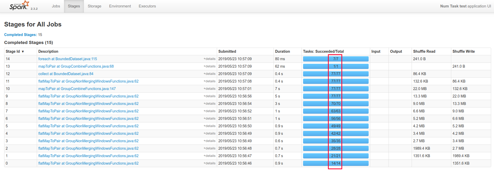
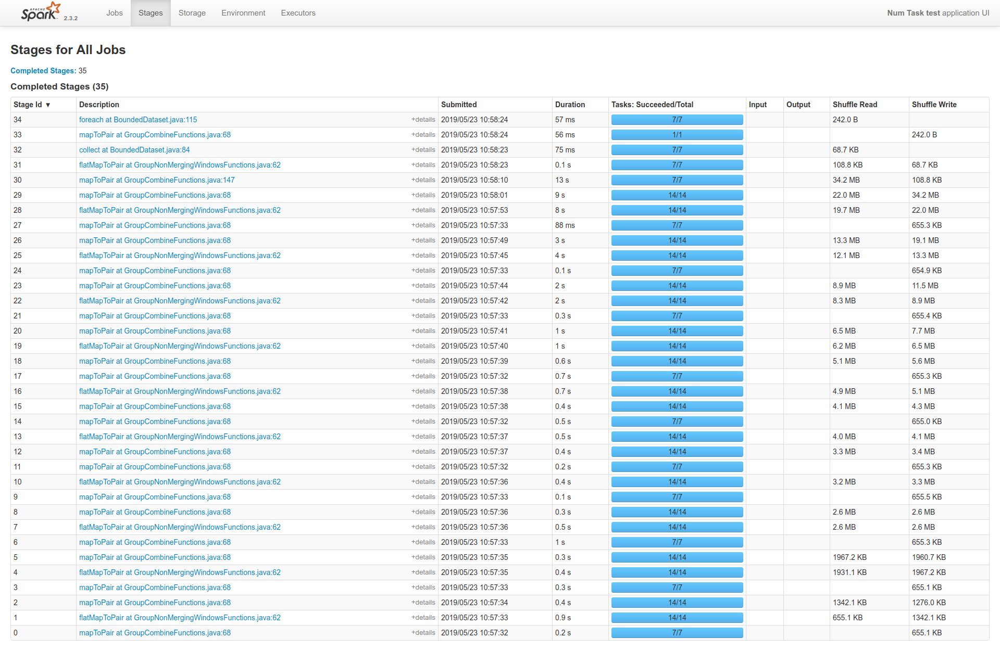

# Combinatorial Explosion of Tasks per Stage in Spark Runner

The code in this repository demonstrates an issue that we have found when running our
pipelines with the latest Beam 2.12.0 on Spark. The issue was not present in Beam 2.8.0

## Versions
Beam 2.12.0

Spark 2.3.2

This issue was not present with Beam 2.8.0 (on Spark 2.3.2)

## Test Code
The test in src/test/java contains two JUnit tests. Both will join a PCollection into another
PCollection.

When running the first test, it will create a stage for every join operation. Each subsequent 
stage will contain more tasks.

In this case, this does not prevent the job from finishing, but on "real" code with larger
datasets and larger pipelines, we've seen this explode into millions of tasks per stage. Which
overloads the entire cluster and halts the pipeline execution (typical issues we see are 
network connections that fail and heartbeats that timeout).

After some experimentation we found two solutions to the exploding tasks problem:
* Use the Reshuffle component after a join (or GroupByKey or CoGroupByKey). However this is marked as deprecated.
* Use the GroupIntoBatches component followed by a custom Flatten implementation

This last solution is showcased in the second test and the number of tasks is completely different 
than in the previous pipeline:

However, this solution comes at a cost, pipeline execution is much slower and there is a lot more
data shuffled.